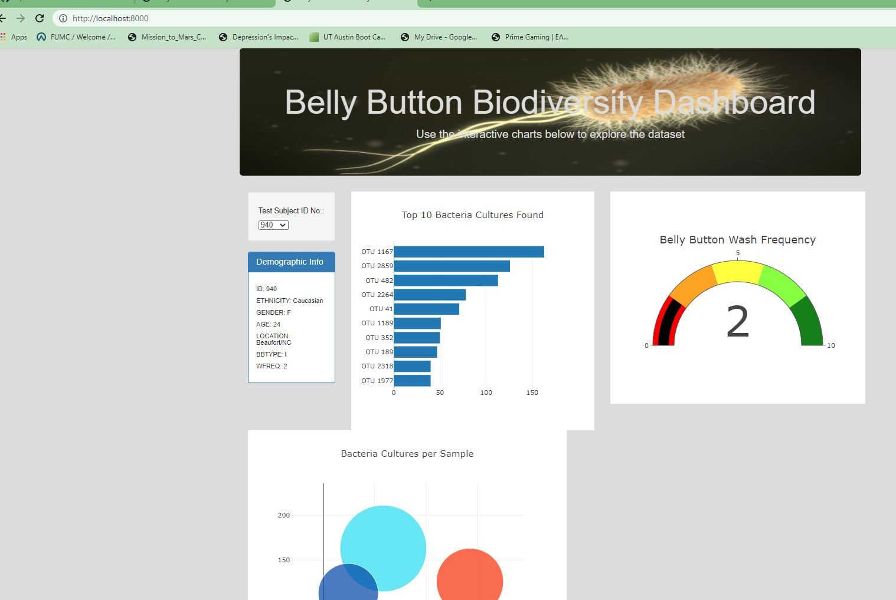

#  Belly Button Biodiversity with Plotly
----------------------------------------------------------------------------------

## Overview of Analysis
In this project, I used Plotly, a JavaScript data visualization library, to create an interactive data visualization for the web. 

## Project Background
This study involves research conducted on bacteria to synthesize proteins that taste like beef.  For some time, labs have created proteins from algae, fungus and microorganisms found on plant roots.  However, none have been able to pass the taste test.  

Research was conducted and results tabulate (attached samples.json file) on bacteria from the human body, and more specifically for this report, in the bellybutton.  

The final visualization is attractive, accessible and interactive.

## Please Note:

A picure has been added to the jumbotron (see below).  While localhosting, the picture is rendered.  However, within Github, it does not.   

This Belly Button Biodiversity site is published at https://mikehankinson.github.io/Biodiversity/
 
 

 
 
